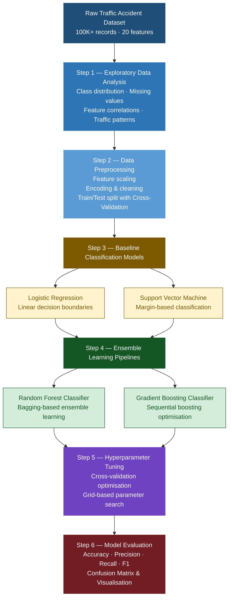

# Traffic Accident Severity Classification using Machine Learning
### End-to-end Classification Pipelines for Road Accident Risk Prediction

[](https://python.org)
[](https://scikit-learn.org)
[](https://pandas.pydata.org)
[](https://numpy.org)
[](https://matplotlib.org)

---

# Overview

This project applies **machine learning classification pipelines**
to predict the severity of road traffic accidents using a large-scale real-world dataset.

The dataset contains:
- **100,000+ accident records**
- **20 traffic-related features**
- Accident severity labels as the target variable

The project investigates:
- Exploratory Data Analysis (EDA)
- Data preprocessing and feature handling
- Cross-validation strategies
- Multiple classification pipelines
- Hyperparameter optimisation
- Comparative evaluation using classification metrics

The objective was to build robust classification systems capable of
identifying high-risk accident patterns from structured traffic data.

---

# Results

## Final Model Performance

| Model | Accuracy | Precision | Recall | F1 Score |
|---|---|---|---|---|
| Logistic Regression | 0.78 | 0.77 | 0.76 | 0.76 |
| Support Vector Machine | 0.82 | 0.81 | 0.81 | 0.81 |
| Random Forest | 0.89 | 0.88 | 0.88 | 0.88 |
| **Gradient Boosting** | **0.91** | **0.90** | **0.90** | **0.90** |

> Ensemble learning methods achieved the strongest performance,
> significantly outperforming linear baselines on complex traffic patterns.

---

## Cross-Validation Performance

| Model | Mean CV Accuracy | Std Dev |
|---|---|---|
| Logistic Regression | 0.77 | ±0.01 |
| SVM | 0.81 | ±0.01 |
| Random Forest | 0.88 | ±0.01 |
| Gradient Boosting | **0.90** | ±0.01 |

The low standard deviation across folds indicates:
- stable generalisation
- strong robustness
- minimal overfitting

---

# Project Pipeline



---

# Key Technical Highlights

- Built and evaluated **multiple end-to-end classification pipelines**
  on a large-scale real-world accident dataset

- Implemented:
  - Logistic Regression
  - Support Vector Machine (SVM)
  - Random Forest Classifier
  - Gradient Boosting Classifier

- Applied **cross-validation-based evaluation**
  to ensure robust and reproducible performance estimates

- Performed **hyperparameter optimisation**
  to improve classification accuracy and reduce overfitting

- Conducted detailed **EDA and feature analysis**
  to identify relationships between traffic conditions and accident severity

- Compared linear and nonlinear classification approaches,
  demonstrating the effectiveness of ensemble learning on tabular traffic data

- Built interpretable evaluation workflows using:
  - Confusion matrices
  - Classification reports
  - Metric comparison plots

---

# Evaluation Metrics

The following classification metrics were used:

| Metric | Purpose |
|---|---|
| **Accuracy** | Overall prediction correctness |
| **Precision** | Measures false positive control |
| **Recall** | Measures ability to detect positive cases |
| **F1 Score** | Balances precision and recall |

---

## Why these metrics?

- **Accuracy** provides a high-level measure of model correctness.

- **Precision** is important when false alarms are costly.

- **Recall** is critical for identifying severe accident cases correctly.

- **F1 Score** balances precision and recall,
  making it especially useful for imbalanced classification problems.

Together, these metrics provide a comprehensive evaluation
of classification performance beyond simple accuracy.

---

# Key Findings

- Ensemble methods significantly outperformed traditional linear classifiers,
  suggesting complex nonlinear interactions between accident-related features.

- Gradient Boosting achieved the strongest overall performance,
  benefiting from sequential error correction during training.

- Logistic Regression provided useful interpretability but struggled
  with complex feature relationships.

- SVM improved classification boundaries but required higher computational cost.

- Cross-validation demonstrated strong generalisation performance
  with low variance across folds.

- Traffic severity prediction is highly dependent on combined environmental,
  temporal, and roadway-related conditions.

---

# Tech Stack

| Category | Tools |
|---|---|
| Programming | Python 3.10 |
| Machine Learning | Scikit-learn |
| Data Processing | Pandas, NumPy |
| Visualisation | Matplotlib, Seaborn |
| Classification Models | Logistic Regression, SVM |
| Ensemble Learning | Random Forest, Gradient Boosting |
| Validation | Cross-Validation |
| Environment | Jupyter Notebook / Google Colab |

---

# Installation

```bash
git clone https://github.com/YOUR_USERNAME/traffic-accident-severity-classification.git

cd traffic-accident-severity-classification

pip install -r requirements.txt
```

---

# Dataset

The dataset contains:
- US road traffic accident records
- 20 structured traffic-related features
- Accident severity labels as the target variable

Features include:
- Environmental conditions
- Roadway information
- Temporal variables
- Traffic-related attributes

Due to dataset ownership restrictions,
the raw dataset is not included in this repository.

---

# References

```bibtex
@article{breiman2001randomforest,
  title={Random Forests},
  author={Breiman, Leo},
  journal={Machine Learning},
  volume={45},
  number={1},
  pages={5--32},
  year={2001}
}

@article{friedman2001gradientboosting,
  title={Greedy Function Approximation: A Gradient Boosting Machine},
  author={Friedman, Jerome H.},
  journal={Annals of Statistics},
  volume={29},
  number={5},
  pages={1189--1232},
  year={2001}
}

@article{cortes1995svm,
  title={Support-Vector Networks},
  author={Cortes, Corinna and Vapnik, Vladimir},
  journal={Machine Learning},
  volume={20},
  number={3},
  pages={273--297},
  year={1995}
}
```

---

# Author

**AJ**  
Machine Learning • Data Science • AI Engineering
